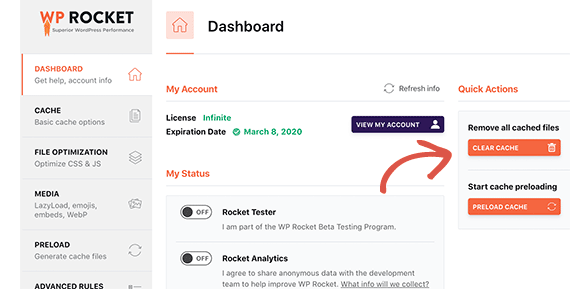

`On most systems if you installed Apache with a package manager, or it came preinstalled, the Apache configuration file is located in one of these locations`
 ```bash
 /etc/apache2/httpd.conf
 /etc/apache2/apache2.conf
 /etc/httpd/httpd.conf 
 /etc/httpd/conf/httpd.conf
 ```
 If you installed Apache from source it is likely located in /usr/local or /opt, though the config files may have been moved to /etc as usual. Check your build script for more details.

# Disable Apache Server Cache when installing WP Rocket

WP Rocket is probably causing a conflict to your server cache. If you are using Apache, you need to delete the cache or clear Apache cache. If it still doesn't work then lets completely disable the Apache Cache of your website. 

### How to Clear Apache Cache
Instead of disabling Apache cache, if you only want to clear Apache cache, then you can remove the contents in Apache’s cache folder located at /var/cache/apache2/mod_cache_disk/
 ```bash
 $ sudo rm -r /var/cache/apache2/mod_cache_disk/*
 ```
### 1. Open .htaccess file
There are many ways to disable Apache cache. If you use htaccess file, open it in a text editor.
You will typically find .htaccess file in your site’s root folder (e.g /var/www/html/). You can open it using vi editor.
 ```bash
 $ sudo vim /var/www/html/.htaccess
 ``` 

### 2.Disable Apache Cache
Let’s say you want to disable caching html, js, css files only, then add the following lines to your .htaccess file.
 ```bash
 #Initialize mod_rewrite

 RewriteEngine On
 <FilesMatch "\.(html|htm|js|css)$">
  FileETag None
  <IfModule mod_headers.c>
    Header unset ETag
    Header set Cache-Control "max-age=0, no-cache, no-store, must-revalidate"
    Header set Pragma "no-cache"
    Header set Expires "Wed, 12 Jan 1980 05:00:00 GMT"
  </IfModule>
 </FilesMatch>
 ```

If you want to also stop caching other file types such as pdf, jpg, etc. include them in line 3 above.

### 3. Restart Apache Server
Restart Apache Server to apply changes

```bash
$ sudo service apache2 restart
```

### 4. After you disable Apache cache, Restart WP Rocket
Simply go to the plugins settings page, and you'll find the options to clear WP Rocket cache on the Dashboard tab. You can also start a preloading sequence to rebuild the cache on demand. 



